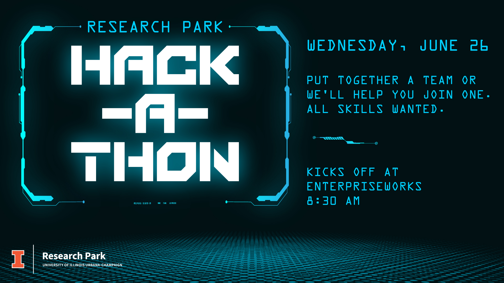

[discord_link]: https://discord.gg/UsFXMVsQ
[submission_link]: https://forms.gle/mfe7GUAXTiA8gAiq6

# 2024 Research Park Hackathon

Welcome to the 2024 Research Park Hackathon! Here are some helpful links:

- [Discord][discord_link]
- [Kickoff Presentation](<Kickoff Presentation.pdf>)
- [Submission Link][submission_link]

This year's prompt is all about data. Bring your favorite dataset or api and get to work.

# Submissions

| Project Name                     | Company Name(s)   | GitHub Repository                                                                                                      | YouTube Video                                                                                                                |
| -------------------------------- | ----------------- | ---------------------------------------------------------------------------------------------------------------------- | ---------------------------------------------------------------------------------------------------------------------------- |
| PsychAI                          | AGCO Corporation  | [https://github.com/BhavikaBhutani/Hackathon-24](https://github.com/BhavikaBhutani/Hackathon-24)                       | [https://youtu.be/hk-HNtIegWM](https://youtu.be/hk-HNtIegWM)                                                                 |
| Playlistify                      | State Farm        | [https://github.com/ChideraIbe123/Spotify-Public-Playlists](https://github.com/ChideraIbe123/Spotify-Public-Playlists) | NA                                                                                                                           |
| Wandertunes                      | UIRP/EW           | [https://github.com/sujeet-bhalerao/uirp-hackathon](https://github.com/sujeet-bhalerao/uirp-hackathon)                 | [https://youtu.be/dySFHz29ilY](https://youtu.be/dySFHz29ilY)                                                                 |
| WeedInator                       | AGCO              | [https://github.com/TanviKulk/UIRP_Hackathon_2024](https://github.com/TanviKulk/UIRP_Hackathon_2024)                   | [https://youtu.be/IJWQz-u4utU](https://youtu.be/IJWQz-u4utU)                                                                 |
| BeachWatch                       | Brunswick         | [https://github.com/aditi135/rphackathon](https://github.com/aditi135/rphackathon)                                     | [https://youtu.be/tRjiSXGdlJU?si=vi85VE54LWrdhckh](https://youtu.be/tRjiSXGdlJU?si=vi85VE54LWrdhckh)                         |
| Rivian Hill Climb                | Rivian            | [https://github.com/MeanPaper/UIRP-Rivian-R1-Hackathon](https://github.com/MeanPaper/UIRP-Rivian-R1-Hackathon)         | [https://youtu.be/ouG6OJ9qJG8](https://youtu.be/ouG6OJ9qJG8)                                                                 |
| OccuPi                           | AGCO, Ameren      | [https://github.com/rishab-t0910/agco_ameren_hackathon](https://github.com/rishab-t0910/agco_ameren_hackathon)         | [https://youtu.be/ZdkVOZDkzZo](https://youtu.be/ZdkVOZDkzZo)                                                                 |
| ClassConnect                     | Capital One       | [https://github.com/ishaan-bhandari/ClassConnect/](https://github.com/ishaan-bhandari/ClassConnect/)                   | [https://www.youtube.com/watch?v=i7vJvzvM7Zo&feature=youtu.be](https://www.youtube.com/watch?v=i7vJvzvM7Zo&feature=youtu.be) |
| Refugee Haven Search             | Kohler            | [https://github.com/leesunny790/asylum-countries-match](https://github.com/leesunny790/asylum-countries-match)         | [https://youtu.be/pwx9-rr2_6U](https://youtu.be/pwx9-rr2_6U)                                                                 |
| EV Charger Location Optimization | Rivian            | [https://github.com/Siddarth2004/Rivian-R2-UIRP-Hackathon](https://github.com/Siddarth2004/Rivian-R2-UIRP-Hackathon)   | [https://www.youtube.com/watch?v=MfCeADfFM3w](https://www.youtube.com/watch?v=MfCeADfFM3w)                                   |
| GeoGroove (COUNTRYmen)           | COUNTRY Financial | [https://github.com/ekcom/COUNTRYmen](https://github.com/ekcom/COUNTRYmen)                                             | [https://www.youtube.com/watch?v=R1Q6YFUD4QM](https://www.youtube.com/watch?v=R1Q6YFUD4QM)                                   |

# Hackathon Prompt

**Build something impactful and creative that leverages data in a meaningful way.**

## What to Make

### Front-End Applcation

Build a front-end application that consumes a static dataset or a live api. Allow users to interact with your data.

### Chatbot

Train a chatbot specifically to your dataset. Show us what it can do.

### Data Visualization

Have a creative and unique way to display your data? Show us!

### Machine Learning Model

Create a predictive model that forecasts future trends.

### App Feature

Pitch, mockup, build, or redesign a feature for a data-focused application.

### Whitepaper

Did you find something interesting in the data? Write up a report detailing your findings. Be sure to include charts and graphs!

### Other

Anything else you can think of, so long as it is focused on data.

## Where to Get Data

- [Kaggle](https://www.kaggle.com)
- [UC Irvine](https://archive.ics.uci.edu)
- [Google Datasets](https://datasetsearch.research.google.com)
- [Spotify API](https://developer.spotify.com/documentation/web-api)
- [My Spotify Data](https://support.spotify.com/us/article/understanding-my-data/)
- [Open Weather API](https://openweathermap.org/api)
- [Hugging Face](https://huggingface.co)
- [data.gov](https://data.gov)
- [UIUC Databank](https://databank.illinois.edu/datasets)
- Anywhere you want! BYOD!

# Schedule

## Wednesday, June 26th 2024

- **8:30 AM**: Hackathon Prompt Instructions @ EnterpriseWorks Atrium
- **9:00 AM**: Hacking Begins @ various UIRP locations
- **12:00 PM - 1:00 PM**: Lunch provided @ EnterpriseWorks Atrium
- **11:59 PM**: **Submission Deadline**

## Thursday, June 27th 2024

- **10:00 AM**: Finalists announced via email / Discord
- **12:00 PM - 12:45 PM**: Finalist presentations @ EnterpriseWorks Atrium
  - open to the public, no lunch provided
- **5:00 PM**: Winners announced at Fire @ Five
  - Register for food [here](https://forms.illinois.edu/sec/1865920012)

# Submissions

When ready, submit projects [here][submission_link].

## Requirements

**1. GitHub**  
Each team must submit a public GitHub repository. It must contain the following:

- README.MD
  - Writeup explaing the submission
  - A link to your YouTube Video (see below)
- Code
  - Include all code written
  - Applicable documentation
- Data
  - Small data files: include entire file
  - Large data files: include small sample and/or link to source

**2. YouTube**  
Each team must upload a video to YouTube.

- Serves as your "pitch" for your submission
- Video must be between 2-3 minutes in length
- Published on YouTube by submission deadline (unlisted or public)

**3. Presentation (Finalists only)**
Teams selected as finalists (see schedule) will be required to do a live presenation to the judges' panel.

- At most 5 minutes in length
- Some things you may wish to include in your presentation
  - Explanation of your product
  - Description of your data
  - Inspiration for your project

# Integrity

- **You are encouraged to use all AI tools at your disposal**
  - For those using work laptops, be wary of your company’s policy
  - Document any tools that you used in your repository’s README
- Copying code from other Hackathon teams is prohibited

# Evaluations

## Judges

- **[Matt Ahrens](https://www.linkedin.com/in/matt-ahrens-b62984/)**: _Data Science_ - NVIDIA
- **[Bryan Goode](https://www.linkedin.com/in/bdgoode/)**: _Talent Management_ - University of Illinois Research Park
- **[Jarai Carter, PhD](https://www.linkedin.com/in/jaraicarter/)**: _Data Science_ - John Deere
- **[Dustin Mayfield-Jones](https://www.linkedin.com/in/dustin-mayfield-jones-77432a40/)**: _Laboratory and Facilities Management_ - University of Illinois Research Park

## Pillars

Judges will assess submissions by the the following three pillars.

### Creativity

_How innovative, creative, and new is your submission?_

High Creativity Score: _A novel idea, fresh take, or otherwise creative submission_

Low Creativity Score: _An exact copy of an existing solution_

### Data

_How well is data integrated into your submission?_

High Data Score: _Data is perfectly interwoven and complements your submission_

### Execution

_How much did your team execute?_

High Execution Score: _A fully-functioning submission or thorough proposal_

Low Execution Score: _Just an idea_

## Awards

- 1st place\*
- 2nd place\*
- 3rd place\*
- Notable Innovation (Creativity)
- Seamless Integration (Data)
- Skill Execution (Execution)

\*reserved for finalists

# James's Tips

- Start small, your development time is very limited
- Prioritize creativity over complexity
- Utilize every team member thoroughly
- Work with data that:
  - is interesting to you
  - you have previous knowledge with
- Play to your team’s strengths!

 

**Good luck!** - James Kabbes | John Deere
